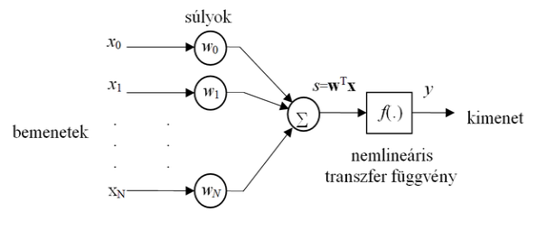
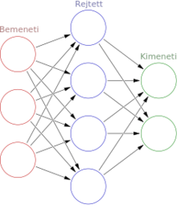
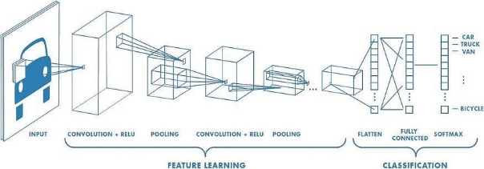
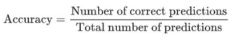
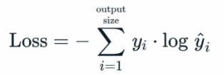
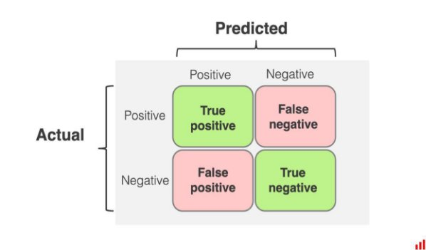
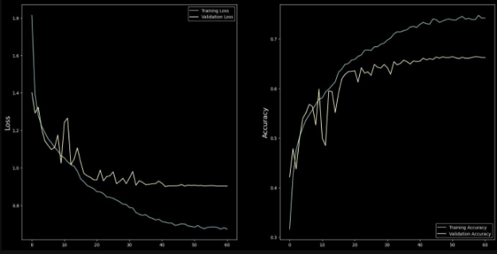
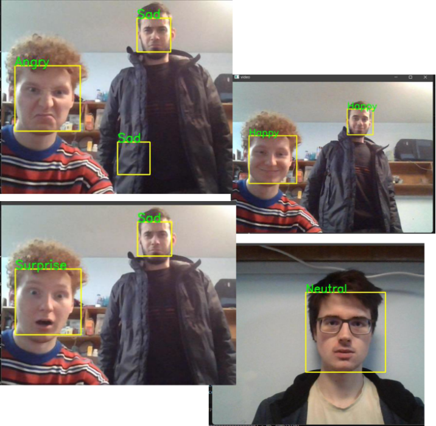

Érzelemfelismerés konvolúciós neurális hálóval 

Témalaboratórum 

Horváth Kristóf 

2023\.12.10 

1. **Bevezetés** 

Témának az érzelemfelismerést választottam. A projektet OpenCV és Keras tensorflow technológiák segítségével oldottam meg. Az OpenCV saját arc detektáló modelljét vettem alapul ('haarcascade\_frontalface.xml'), ami egy adott képen felismeri, hogy van-e arc és, ha igen hol helyezkedik el. Ez a modell az összes olyan képen lévő arcot érzékeli ami szembe néz a kamerával. 

A projektet 3 fő részre bontottam 

- Az első az adatok begyűjtése az érzelemfelismerő háló tanításához és teszteléséhez. 
- Ezután a konvolúciós neurális háló felépítése jön. 
- És legvégül a tanítás és tesztelés marad 
2. **Adatkészlet előkészítése** 

A FER 2013[1] egy széles körben elterjedt adatkészlet, amit gyakran használnak érzelemfelismeréses projektekhez és versenyekhez. Én ezt vettem alapul a convolúciós hálózathoz használt adatkészlet megalkotásához.  

Az első probléma ezekkel az adatokkal az volt, hogy mindenféle szögből készített képek voltak találhatóak benne. Ezek számunkra feleslegesek voltak, hiszen a neurális hálózat, amit használunk, az arcok azonosítására egy képen, csak a szemközti arcokat ismeri fel. Az opencv python könyvtár segítségével lettek ezek kiszűrve. 

A második problémát abban merült fel, hogy a különböző kategóriák között nem egyenlően voltak elosztva a képek. Ez problémát jelenthet a későbbiek során hiszen, ha az egyik kategóriában kétszer annyi kép van, mint egy másikban, akkor a hálónk azt részesítené előnyben, amiben több kép van. Mivel az undor érzelemhez tartozó képekből a többi kategóriához viszonyítva sokkal kevesebb volt, ezért ez a kategória el lett hagyva. 

Az utolsó változtatás az adatkészleten egy konvertálás volt képekből számtömbökké. Ez a lépés nem az adatszűrés szempontjából volt fontos, hanem optimalizáció szempontjából. Tárolhattuk volna az adatkészletet képekként is viszont, akkor minden egyes alkalommal amikor betöltjük, ezeket a képeket, akkor át kellet volna őket konvertálni egy használható formátumba, ezzel lassítva a tanítás menetét. Ezt a lépés a NumPy könyvtár használatával ment végbe. 

3. **A Konvolúciós neurális háló** 

A neurális hálók alapköve a neuron. A neuron közvetíti az információt a háló rétegei között, ezt előre terjesztésnek hívjuk. A legelterjedtebb változata a memória nélküli neuron, ami egyenértékű bemenetekkel rendelkezik A továbbított értéket úgy kapjuk meg, hogy a neuronba kötött bemenetek értéket megszorozzuk a súlyukkal majd ezeket összeadjuk. Ezután a kapott eredményt általában egy nemlineáris függvény segítségével kiértékeljük, ami visszaad egy 0 és 1 közötti értéket amit a kimenetét küld tovább a neuron a további rétegek felé.  

[2] 

A háló rétegei több ilyen neuronból állnak össze, amik a legegyszerűbb esetben kapcsolódnak az őket megelőző és őket követő réteghez. A neurális hálók rétegeinek fő csoportosítása három csoportot határoz meg. Az első a bemeneti réteg, ez jelképezi, fogadja azt az adatot, amit odaadunk a hálónak kiértékelésre. A középső rejtett réteg általában több réteget foglal magában, amik a háló céljától eltérően változnak. Az utolsó a kimeneti réteg, amin az eredményt vagy eredményeket kapjuk meg. 

[3] 

` `A Konvolúciós neurális háló amit itt is használunk két főbb részből áll. Az első rész a kép jellemzőit azonosítja és tanulja meg. A mi esetünkben ezek arcvonások. A második pedig egy osztályozó rész ami a kiszűrt tulajdonságok alapán kategorizálja a bemenetet. 

[4] 

1. **Rétegek a hálóban** 

Az első részben az itt használt rétegek a következők: **Konvolúciós réteg (Convolutional Layer)** 

A konvolúciós réteg neuronai kis régiókon kernelen keresztül "pásztáznak" az input rétegen, és egy konvolúciós művelettel kiszámítják az aktivációs térképet. Minden neuron az input réteg kis részét nézi, és a súlyokat és a nem-lineáris aktivációs függvényeket alkalmazza azokra az értékekre. Ezáltal a neuronok különböző jellemzőket tanulnak meg, például élek, formák vagy színek. 

**Pooling réteg (Pooling Layer)** 

A pooling réteg csökkenti a térbeli dimenziókat, például max-pooling alkalmazásával. Ezáltal csökken a számításigény és a túlzott illeszkedés kockázata, miközben az alapvető jellemzők megmaradnak. 

A második részben használt réteg a **sűrű réteg (dense layer)**  

a neurális hálózat egy olyan rétege, amelyben minden neuron kapcsolódik minden más neuronhoz a következő rétegben. 

Még ezeken kívül használjuk az **aktivációs réteget**, ez tartalmazza a nem lineáris függvényeket, amiket egy adott rétegen használunk. 

A hálón még használunk két technikát: **kötegelt normalizálás (batch normalization):** 

Normalizálja a bemeneteket a batch alapján, és ezzel segít a hálózat stabilitásának növelésében és a tanulás gyorsításában 

**Dropout:** A rétegben amire alkalmazzuk deaktivál neuronokat, ezáltal megelőzve az overfitting jelenséget. Az overfitting az a jelenség amikor a háló pontossága a betanító adathalmazon sokkal magasabb, mint a tesztelő adathalmazon, vagyis megtanulta a betanító adathalmaz olyan jellegzetességeit amik nem fontosak a megoldás szempontjából. 

2. **A használt Konvolúciós háló felépítése** 

A háló a Keras python könyvtár segítségével készült el Rétegek: 

1. **input layer – (none,48,48,1)** 
1. **Conv2D – (none, 48,48,64)** 
1. BatchNormalization - (none, 48,48,64) 
1. **Activation(relu) – (none, 48,48,64)** 
1. **MaxPooling2D – (none, 24,24,64)** 
1. Dropout(0.25) – (none, 24,24,64) 
1. **Conv2D – (none, 48,48,128)** 
1. BatchNormalization - (none, 48,48,128) 
1. **Activation(relu) – (none, 48,48,128)** 
1. **MaxPooling2D – (none, 12,12,128)** 
1. Dropout(0.4) – (none, 12,12,128) 
1. **Conv2D – (none, 12,12,256)** 
1. BatchNormalization - (none, 12,12,256) 
1. **Activation(relu) – (none, 12,12,256)** 
1. **MaxPooling2D – (none, 6,6,256)** 
1. Dropout(0.5) – (none, 6,6,256) 
1. **Flatten - (none, 9261)** 
1. **Dense – (none, 256)** 
1. BatchNormalization - (none, 256) 
1. **Activation(relu) – (none, 256)** 
1. Dropout(0.5) – (none, 256) 
1. **Dense – (none, 6)** 
1. **Activation (softmax) – (none,** **6)** 
1. **A tanítás értékelő számai** 

A neurális hálót két fő mérték alapján szokás mérni. Az első a pontosság (accuracy) ami az eltalált esetek száma osztva az összes esettel.[5] 

A másik pedig a veszteség (loss), itt categorical crossentropy típusú veszteséget használunk. 

Ezeken kívül a hatékonyság vizualizálásához konfúziós mátrixot használunk. A modell által prediktált osztályokat összehasonlítja, és különböző értékekkel töltik ki a mátrix celláit.[6] 

[7] 

A mi esetünkben 6 sor és oszlop lesz. A sor és oszlopnevek a kategóriák nevei lesznek és minden, ami nem a főátlón van false értéknek fog számítani. 

2. **Tanítás különböző paraméterekkel** 

A modell tanításakor a változtatható paraméterek: 

**Learning rate** – Azt szabályozza, hogy milyen ’gyorsan’ tanul a modell, milyen mértékben változtatja a visszaterjesztés során a súlyokat  

**Batch size** – Egyszerre hány adatot küldünk át a modellen 

**Epoch number** – Hányszor küldjük át a teljes tanító adatkészletet a modellen 

**Optimizáló**  

Két eszközt használtam a keras könyvtárból, ezen változók értékének szűkítésében, javításban. 

Az első az **EarlyStopping**, ez be lett állítva, hogy a validációs adatok pontosságát (val\_accuracy) figyelje és ha 10 epoch-on keresztül nincs benne javulás akkor leállítja a tanítást, és betölti a legjobb eredményt elérő súlyokat. 

Ennek a használatával nem kell foglalkoznunk az epoch number meghatározásával. Ezt az értéket mindenhol 100-ra állítottam, mert a tapasztalataim alapján addig sosem fog eljutni. Például itt a teljesítménye az alábbi tanulásnak: 

|batch size |16 |
| - | - |
|learning rate |0\.01 |
|optimalizáló |Nadam |

Egy másik eszköz, amit használtam a ReduceLROnPlateau. Ezzel csökkenthető futás közben a learning rate. Ezt egy kis kísérletezés után úgy állítottam be, hogy ha a validációs pontosság nem javul 4 epoch után, akkor a learning rate 0.4-gyel redukálódik, amíg el nem éri a 0.0001 alsó határt. Ezáltal tovább finomítva a modell tanítását. 

Ezen beállítások mellett, az alábbi eredmények születtek. 

||Test1 |Test2 |Test3 |Test4 |Test5 |
| :- | - | - | - | - | - |
|Learning rate |0\.01 |0\.01 |0\.001 |0\.01 |0\.001 |
|Batch size |16 |16 |16 |32 |32 |
|Optimizer |Nadam |Adam |Adam |Adam |Adam |
|**Loss** |**1.43** |**0.91** |**1.05** |**0.97** |**1.32** |
|**Accuracy** |**0.65** |**0.7** |**0.67** |**0.68** |**0.63** |

**5. Eredmény**

A végső program elég jól ismeri fel az érzelmeket képekről és videó folyamból. Legjobban a neutrális és boldog arckifejezéseket azonosítja a videók alapján. Szerintem overfitting jelentkezik és még lehetne javítani rajta. Alább néhány kép látható a programról: 

Források: 

[https://www.nature.com/articles/s41598-022-11173-0 ](https://www.nature.com/articles/s41598-022-11173-0)[https://www.hindawi.com/journals/jece/2023/9351345/fig1/ ](https://www.hindawi.com/journals/jece/2023/9351345/fig1/)https://www.hindawi.com/journals/jece/2023/9351345/ https://www.youtube.com/watch?v=qFJeN9V1ZsI 

1. [https://www.kaggle.com/datasets/msambare/fer2013/ ](https://www.kaggle.com/datasets/msambare/fer2013/)
1. https://project.mit.bme.hu/mi\_almanach/books/neuralis/ch01s02 
1. https://upload.wikimedia.org/wikipedia/commons/thumb/b/b9/Szines\_neuralis\_halo.png/220px- Szines\_neuralis\_halo.png 
1. https://towardsdatascience.com/a-comprehensive-guide-to-convolutional-neural-networks-the-eli5- way-3bd2b1164a53 
1. https://miro.medium.com/v2/resize:fit:1400/1\*udGMH6OQF4CMcv42mjW\_qg.png 
1. https://miro.medium.com/v2/resize:fit:1400/0\*pLyDoA9oQU7xq8i\_.png 
1. https://assets-global.website- files.com/6266b596eef18c1931f938f9/644aea65cefe35380f198a5a\_class\_guide\_cm08.png 
